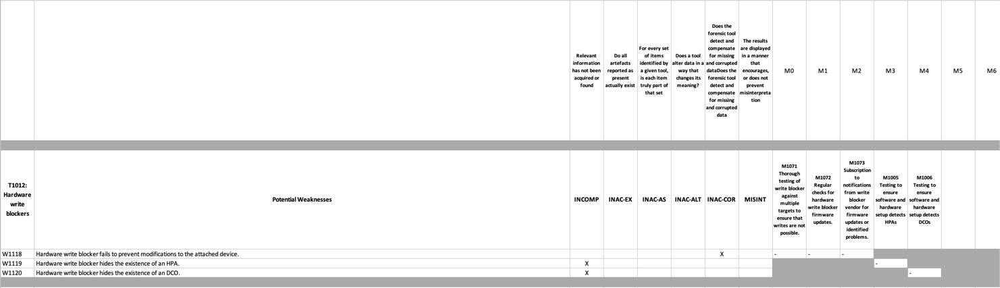

# Forensic workflow example: forensic Imaging

## Introduction
This example shows how SOLVE-IT can be used to examine a forensic workflow and consider the weaknesses in the process and evaluate the mitigations in place.

## An example process

For this example we can take the process required to acquire data from a hard disk. 

Referred to broadly as 'disk imaging', 
when mapped as a *process* against SOLVE-IT techniques, 
there are several that are used. For example:

* T1012: Hardware write blocker[^1]
* T1002: Disk imaging
* T1025: Writing to a forensic image
* T1042: Disk image hash verification

[^1]: Some workflows may use software write blockers (T1013), but this example assumes hardware devices in place.

## Using SOLVE-IT

The utility python script `generate_evaluation.py` can be used here.

Running the script with those technique IDs as parameters, compiles an Excel spreadsheet that extracts the weaknesses and available mitigations into a reviewable form.

```
python generate_evaluation.py T1021 T1002 T1025 T1042
```


This output will highlight that, for example, under the technique T1012: Hardware write blocker, there are currently three potential weaknesses

* Hardware write blocker fails to prevent modifications to the attached device.
* Hardware write blocker hides the existence of an HPA.
* Hardware write blocker hides the existence of an DCO.

The figure below shows a section of the example output mapping the available mitigations against those potential weaknesses.



This allows the overall process to be reviewed, and the dropdowns used to record whether mitigations are in place or not. For example, for W1118: Hardware write blocker fails to prevent modifications to the attached device, there are three potential mitigations indexed:

* M1071 Thorough testing of write blocker against multiple targets to ensure that writes are not possible.
* M1072 Regular checks for hardware write blocker firmware updates.
* M1073 Subscription to notifications from write blocker vendor for firmware updates or identified problems.

A full example .XLXS file for this illustration is available [here](case_evaluation-imaging-example.xlsx), generated in the exact manner described above. 

## Extending this with 'lab configurations'

TODO
