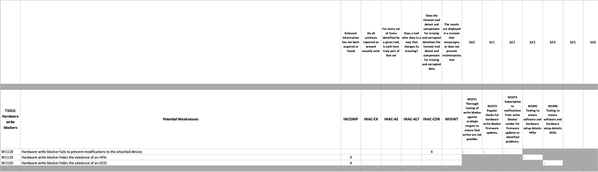
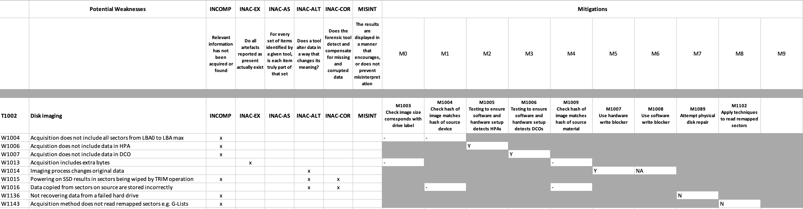

# Forensic workflow example: forensic imaging

## Introduction
This example shows how SOLVE-IT can be used to examine a forensic workflow and consider the weaknesses in the process and evaluate the mitigations in place.

## An example process

For this example we can take the process required to acquire data from a hard disk. 

Referred to broadly as 'disk imaging', 
when mapped as a *process* against SOLVE-IT techniques, 
there are several that could be used as part of this workflow. For example:

* [DFT-1112: Physical disk identification and removal](https://explore.solveit-df.org/#DFT-1112)
* [DFT-1012: Use hardware write blocker](https://explore.solveit-df.org/#DFT-1012)[^1]
* [DFT-1002: Disk imaging](https://explore.solveit-df.org/#DFT-1002)
* [DFT-1025: Writing bitstream data to a forensic image](https://explore.solveit-df.org/#DFT-1025)
* [DFT-1042: Hash verification of source device against stored data](https://explore.solveit-df.org/#DFT-1042)

[^1]: Some workflows may use software write blockers (DFT-T1013), but this example assumes hardware devices in place.

## Using SOLVE-IT

The utility python script `generate_evaluation.py` can be used here.

Running the script with those technique IDs as parameters, compiles an Excel spreadsheet that extracts the weaknesses and available mitigations into a reviewable form.

```
python generate_evaluation.py DFT-1112 DFT-1012 DFT-1002 DFT-1025 DFT-1042
```

This output will highlight that, for example, under the technique DFT-1012: Use hardware write blocker, there are currently several potential weaknesses including: 

* Hardware write blocker fails to prevent modifications to the attached device.
* Hardware write blocker hides the existence of an HPA.
* Hardware write blocker hides the existence of an DCO.

The figure below shows a section of the example output mapping the available mitigations against those potential weaknesses.



This allows the overall process to be reviewed, and the dropdowns used to record whether mitigations are in place or not. For example, for W1118: Hardware write blocker fails to prevent modifications to the attached device, there are three potential mitigations indexed:

* DFM-1071 Thorough testing of write blocker against multiple targets to ensure that writes are not possible.
* DFM-1072 Regular checks for hardware write blocker firmware updates.
* DFM-1073 Subscription to notifications from write blocker vendor for firmware updates or identified problems.

## Extending this with 'lab configurations'

The 'lab configuration' option is designed to automate completion of some of the fields in the generated spreadsheets. There are several reasons why can be useful:

* A standard workflow is always used in a specific way so 'NA' could be always auto-populated. e.g. a lab never uses software write blockers, only hardware write blockers, so _DFM-1008: Use software write blocker_ should always be '_NA_' and _DFM-1007: Use hardware write blocker_ could always be 'Y'.
* A tool has provided a configuration script, describing the testing that has been performed, thus auto populating Y where tool testing for specific mitigations has been performed by the vendor or open source tool developer.

Lab configurations are JSON files (examples are provided below). They all illustrate how mitigations for specific weakness can be auto-populated with a value

This first extract illustrates that testing of a specific setup may be done as part of lab quality assurance, so this can be captured: 

```
{
  "Lab config notes": "This is a demo to be used with: generate_evaluation.py T1002  --lab_config ../lab_config_examples/example_lab.json ",
  "DFT-1002:Disk imaging": {
    "DFW-1006": {
      "DFM-1005": {
        "status": "Y",
        "notes": "Standard imaging setup tested with HPA disk TTP-HPA-01"
      }
    },
    "DFW-1007": {
      "DFM-1006": {
        "status": "Y",
        "notes": "Standard imaging setup tested with DCO disk TTP-DCO-01"
      }
    },

```


The second extract illustrates that some mitigations are not possible in a specific lab environment, e.g. only hardware write blockers are used, not software ones (so NA is applied automatically),  physical disk repair is not conducted at this lab, and tooling for remapped sector recovery (e.g. G-lists) is not availabe in this lab (so both are given a value of N). The notes are also automatically added to a spreadsheet generated that uses this lab config file.  

```
      "DFM-1008": {
        "status": "NA",
        "notes": "Software write blockers are not used"
      }
    },
    "DFW-1136": {
      "DFM-1089": {
        "status": "N",
        "notes": "Physical repair not undertaken at this lab"
      }
    },
    "DFW-1143": {
      "DFM-1102": {
        "status": "N",
        "notes": "Tooling for recovery of remapped sectors not available at this lab"
      }
    }
  }

```


To use a lab configuration the --lab_config option can be used. 

```

python generate_evaluation.py DFT-1002  --lab_config ../lab_config_examples/example_lab.json

INFO: Loaded 117 techniques.
INFO: Loaded 188 weaknesses.
INFO: Loaded 137 mitigations.
INFO: Building reverse indices for performance optimization...
INFO: Reverse indices built: 184 weakness->technique, 136 mitigation->weakness, 136 mitigation->technique
INFO: Loaded objective mapping 'solve-it.json' with 17 objectives.
INFO: Lab configuration loaded from: ../lab_config_examples/example_lab.json
Max mitigations: 10
['T1002']
INFO: Techniques in lab config: ['DFT-1002:Disk imaging']
INFO: Weaknesses in lab config: ['DFW-1006', 'DFW-1007', 'DFW-1014', 'DFW-1136', 'DFW-1143']
INFO: Mitigations in lab config: ['DFM-1005', 'DFM-1006', 'DFM-1007', 'DFM-1008', 'DFM-1089', 'DFM-1102']
Evaluation workbook successfully generated at: output/solve-it_evaluation_workbook.xlsx

```

The screenshot below shows the auto-populated values in the generated spreadsheet when using the sample lab configuration file example_lab.json.




  


