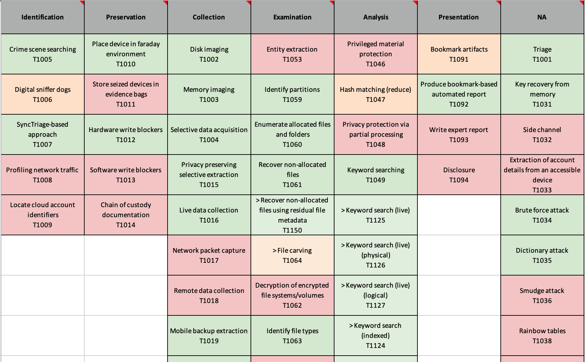

# Reorganization of techniques using process models

## Introduction
This example shows how the techniques can be reorganized using a different configuration file ([solve-it.json](https://github.com/SOLVE-IT-DF/solve-it/blob/main/data/solve-it.json) is the standard organization).

The files:

- [carrier.json](carrier.json)
- [dfrws.json](dfrws.json)

can be used to organize the techniques according to those process models. 


## Using those models

To make use of alternative models, instantiate the SOLVE-IT library with teh path to the new configuration file. 

```
>>> from solve_it_library import KnowledgeBase

>>> config_file = '/Users/user/Desktop/dfrws.json'
>>> solve_it_root = '/Users/user/dev/solve-it'
>>> kb = KnowledgeBase(solve_it_root, config_file)

```


To use `generate_excel_from_kb.py`, you need to directly edit the code, changing the variable `config_file` from `solve-it.json` to the path to your custom json file. If you want to run the demo files provided you will also need to run the generation script with the `--ignore_unindexed_techniques`, as these demo files are not updated with all the latest techniques and will trigger the inconsistency checks otherwise. 

You will see output similar to below where the techniques are now indexed according to a different scheme. 


